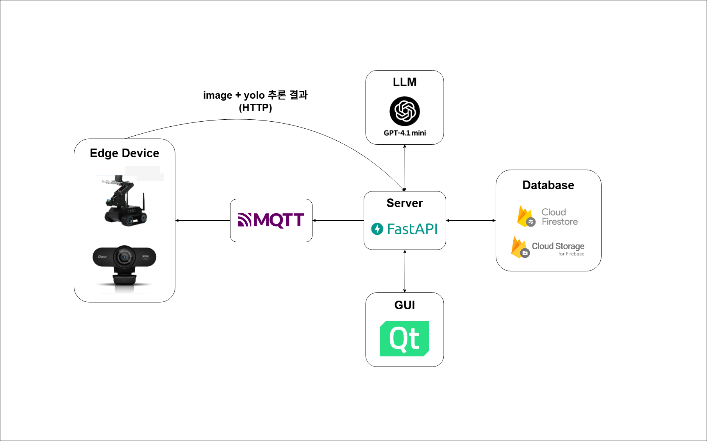
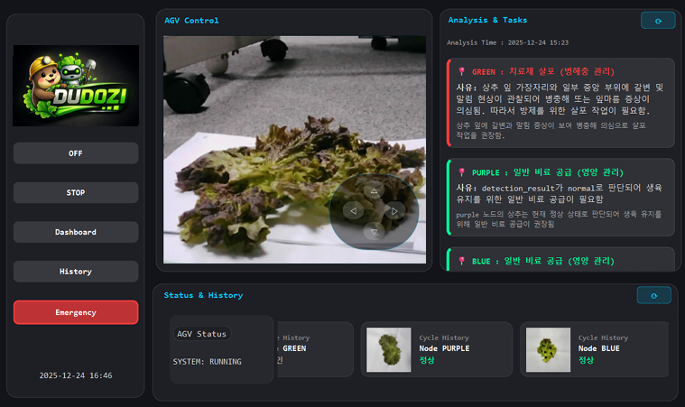

## 🌱 DUDOZI

**DUDOZI**는  
- **DU** : *Dual Protocol*  
- **DO** : *Detect & Operate*  
- **ZI** : *Zone Intelligence*  

의 의미를 담은 **비전 AI 기반 자율 협업형 스마트팜 AGV 시스템**입니다.

 

## 📌 프로젝트 개요

본 프로젝트는 **스마트팜에서 AGV(Automated Guided Vehicle)** 를 활용하여  
작물(상추)을 **정찰 → 분석 → 명령 생성 → 자율 수행**까지 자동으로 처리하는 시스템을 구현하는 것을 목표로 했습니다.

AGV는 농장을 순찰하며 이미지를 수집하고, AI 모델(YOLO + LLM)이 작물 상태를 분석하여 작업 명령을 생성합니다.  
생성된 명령은 FastAPI 서버와 Firestore를 거쳐 MQTT 프로토콜로 AGV에 전달되며, AGV는 해당 명령을 기반으로 **Road Following + Color Detection**을 통해 실제 작업을 수행합니다.

 

## 🧠 시스템 전체 흐름

1. **AGV 정찰**
   - Road Following + Color Detection 기반 자율주행
   - 노드 도착 시 카메라로 작물(상추) 이미지 촬영
   - 촬영 정보(JSON)를 FastAPI 서버로 전송

2. **AI 분석**
   - YOLO 모델을 활용한 작물 상태 분류 (normal / abnormal)
   - 분석 결과와 메타데이터를 LLM에 전달
   - LLM이 농업 전문가 관점에서 작업 명령(JSON) 생성

3. **명령 전달 및 수행**
   - LLM 결과를 Firestore에 저장
   - FastAPI 서버가 Firestore에서 명령을 조회
   - MQTT 프로토콜로 AGV에 작업 명령 전송
   - AGV가 명령에 따라 주행 및 작업 수행

 

## 🏗️ 시스템 아키텍처

 

## 🤖 주요 기능

### 1. AGV 자율 주행
- Road Following + Color Detection 기반 라인 추종
- 주행 중 특정 색상 노드(Color Detection) 인식
- 노드 도착 시 정찰 및 작업 트리거

### 2. 작물 상태 분석 (YOLO)
- 카메라 이미지 입력
- 이진 분류: `normal / abnormal`
- confidence score 포함 결과 생성

### 3. LLM 기반 작업 명령 생성
- YOLO 결과 + 이미지 URL + 메타데이터 입력
- 농업 전문가 프롬프트 기반 판단

### 4. MQTT 기반 AGV 제어
- Firestore에 저장된 명령을 조회
- MQTT 토픽으로 AGV에 명령 전달

 

## 🖥️ GUI 화면

 

## 🚀 기술 스택

- Edge Device: Jetson Nano / Webcam
- Language: Python
- AI: YOLO, LLM(GPT-4.1 mini)
- Frontend: QT Creator
- Backend: FastAPI
- Database: Firebase Firestore, Storage
- Protocol: MQTT, HTTP

 

## ⏱ 개발 기간
- **2025.11.21 ~ 2025.12.24**

 

## 👥 Contributors

### 👑 김지윤 — 팀장
- **FastAPI** 기반 서버 구축
- **GPT API**를 활용한 LLM 설계 및 명령 생성 로직 구현
- **Firebase 기반 DB 구조 설계 및 연동**
- Task를 수행하는 **AGV 로봇팔 제어 로직 설계**

### 👤 박수민 — 팀원
- QtCreator를 이용한 **AGV GUI 구축**
- **YOLO 모델 구현 및 실시간 추론 파이프라인 설계**
- **AGV MQTT 통신 구조 설계**
- **Road Following 알고리즘 고도화** 및 주행 안정화
